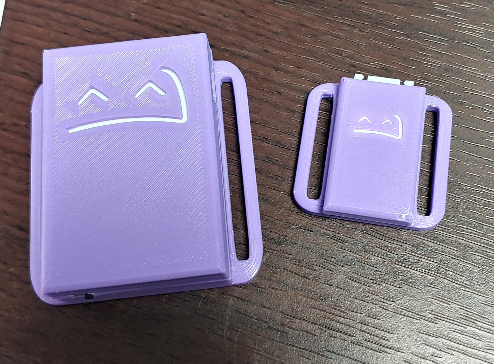
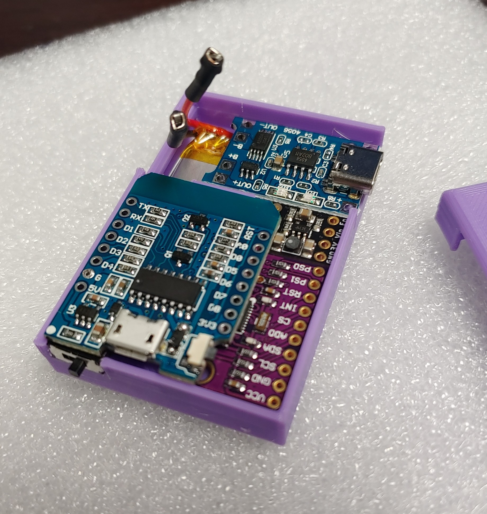
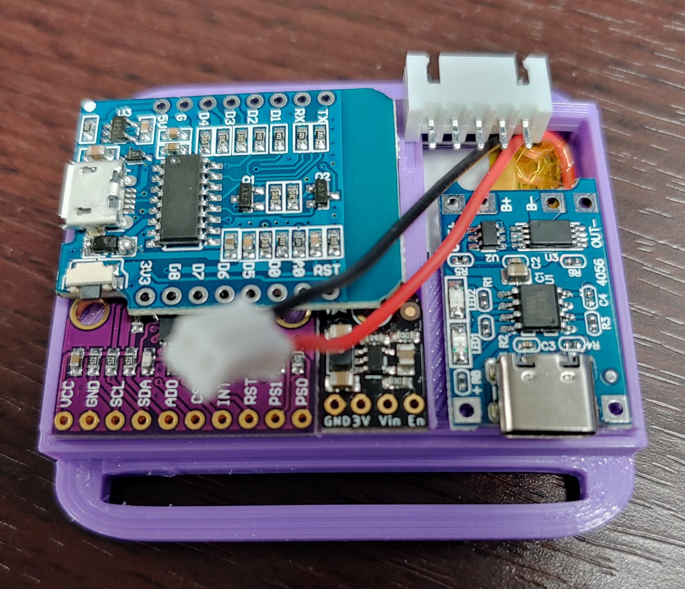

# SlimeVR Compact Case by Twidge

A compact case for SlimeVR trackers using:
- D1 Mini ESP microcontroller
- BNO08X IMU
- TP4056 USB-C charging module
- 503450 1000mAh lithium ion cell
- 7mm x 3mm x 8.3mm panel switch

I recommend printing the tray with support material to keep it dimensionally accurate as it's sized exactly for this battery, you can use a minimal support infill however.

Support should not be necessary for the other parts.  This is a friction-fit piece, with very tight tolerances.  Be sure you seat the tray fully, the spots for the TP4056 and the switches should be _slightly_ recessed when it's completely inserted. Otherwise you may see a small gap between the lid and the base when closed.

Lids should be printed flipped over with the 'top' side against the build plate.

If you print the diffuser in white or a semi-translucent material you can see the battery charge LEDs while charging, however with this design the ESP is 'upside down' and the status LED is not visible.  The diffuser insert is meant to be glued behind the SlimeVR logo in the lid, and may need some trimming to fit the shallow insert space depending on your printer.

When building the tracker, you should first flip the tray over, insert the battery into the tray, and then place the base onto the tray, this will prevent the battery falling out and getting pinched during assembly.

If you will add an extension IMU, use the lit 'wextension' part, it is a little bit taller to fit the 5 pin JST female connector and the extra wires.

Please join me in the SlimeVR Discord server if you'd like to ask me any questions about squeezing all the components into this thing!

https://discord.gg/slimevr

# Recommended layout

There's pretty much only one direction the parts will fit in here, as follows.  Note that I am using an external voltage regulator here (Adafruit: https://www.adafruit.com/product/4711) which is an optional part, you can connect the out+ from the TP4095 directly to the 5Vin pin on the D1 mini ESP.

- Normal layout for standalone tracker

- Layout with 5 pin female JST connector

- Exploded layout (note this was a previous version and the switch has moved)
